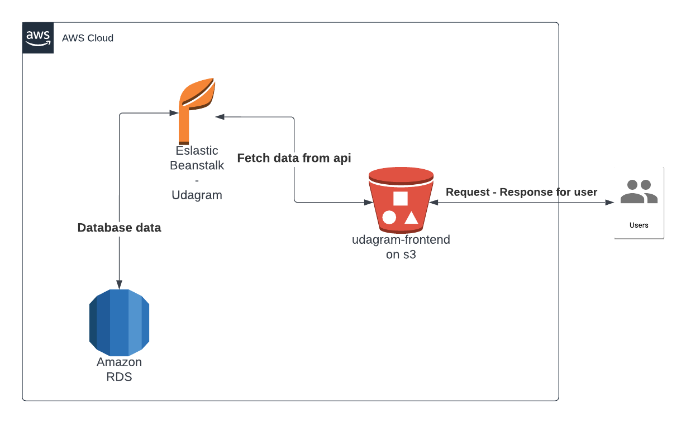

# Infrastructure Description




Project Infrastructure consists of three main components.

1. AWS S3: for static files storage
    * Users can access application thorugh s3 bucket using url below.
    * URL:  http://rinaudagram.s3-website-us-east-1.amazonaws.com 

2. AWS RDS Postgres: database to store and retrieve data 
    URL: ``` database-1.c7xpwhmurrhi.us-east-1.rds.amazonaws.com ```

3. AWS Elastic Beanstalk: Used for deploying and scaling application
    URL: ```  udagram-api-dev.eba-qmtjmzzr.us-east-1.elasticbeanstalk.com ```

 
