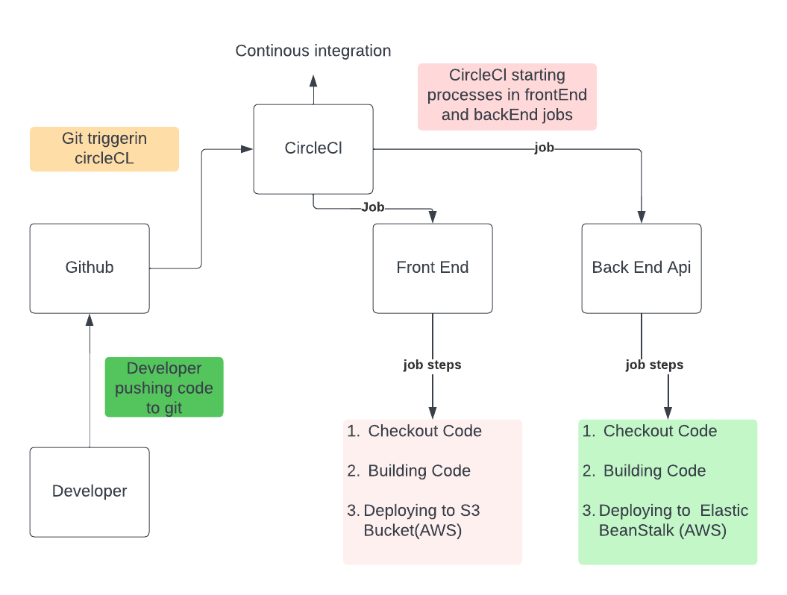

# Pipeline Process



* Orbs: 
```
  node: circleci/node@4.2.0
  aws-cli: circleci/aws-cli@2.0.0
  aws-elastic-beanstalk: circleci/aws-elastic-beanstalk@2.0.1
```

* Jobs(two main jobs) :
    * frontend 
    * api

* Frontend steps:
    1. Spin Up Environment: install node js and its packages
    2. Preparing Environment Variables: exporting environment variables from CircleCl config
    3. Checkout: go to the root directory
    4. Install dependencies: install packages in package.json
    5. Install aws cli: to implement aws cli commands used in deployment
    6. Building and Deploying: execute building and deploying commands in package.json scripts 

* API steps:
    1. Spin Up Environment:install node js and its packages
    2. Preparing Environment Variables: exporting environment variables from CircleCl config
    3. Checkout: go to the root directory
    4. Install dependencies: install packages in package.json
    5. Setting up Elastic Beanstalk cli: to implement eb cli commands used in deployment
    6. Building and Deploying: execute building and deploying commands in package.json scripts  


* Workflow: 
    1. frontend job
        - filter: triger only on main branch
    2. api job
        - filter: triger only on main branch
